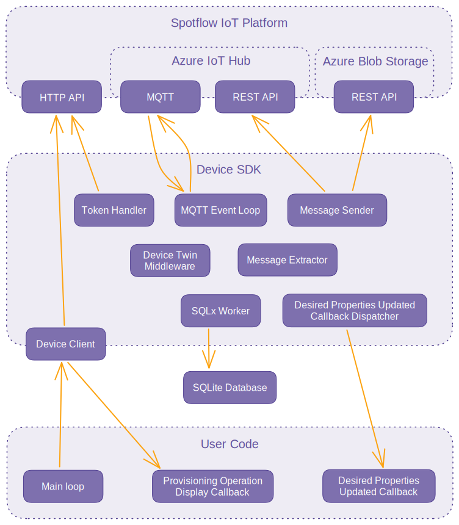
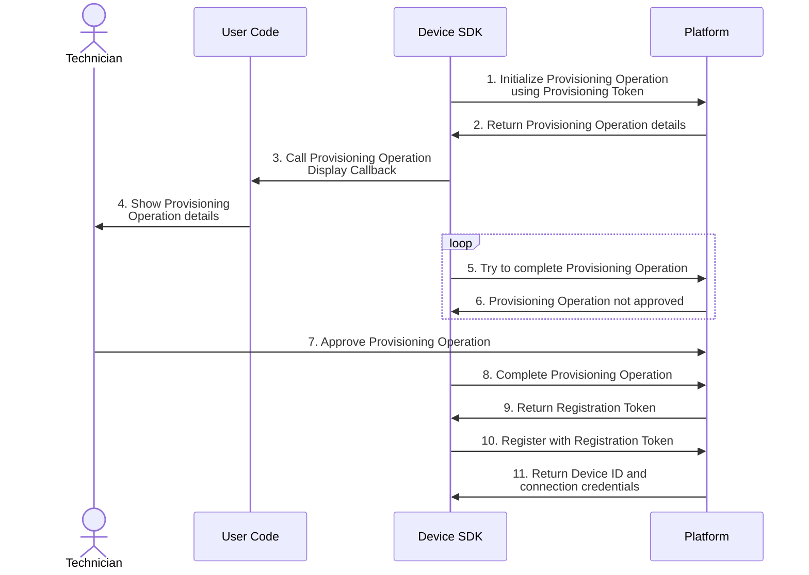

<h1 align="center">Device SDK for Spotflow IoT Platform</h1>

> [!NOTE]
> This repository has been discontinued. The Device SDK now being developed in the [spotflow-io/device-sdk](https://github.com/spotflow-io/device-sdk) repository.

<p align="center">
    <a href="#languages">Languages</a> |
    <a href="#features">Features</a> |
    <a href="#architecture">Architecture</a> |
    <a href="#building-and-testing">Building and Testing</a> |
    <a href="#license">License</a>
</p>

Devices can use this SDK to connect to the [Spotflow IoT Platform](https://spotflow.io).
See the [Device SDK documentation](https://docs.spotflow.io/device-sdk) ([Rust](https://docs.spotflow.io/device-sdk/rust/), [Python](https://docs.spotflow.io/device-sdk/python/), [C](https://docs.spotflow.io/device-sdk/c/)) for more information on how to use it in your projects.
The following text explains how the Device SDK works internally, how you can compile it yourself, and what issues you might encounter.

## Languages

The Device SDK is written in Rust and exposed to other languages using bindings.
The binding for each language is versioned separately because not each change affects all languages.
Furthermore, a breaking change in the Rust interface usually doesn't cause a breaking change in other languages.

| Language | | | | | Package |
|---|---|---|---|---|---|
| **Rust** | [Documentation](https://docs.spotflow.io/device-sdk/rust/) | [Changelog](./spotflow/CHANGELOG.md) | [Source](./spotflow/) | [Building and testing](#rust) | [](https://crates.io/crates/spotflow)
| **Python** | [Documentation](https://docs.spotflow.io/device-sdk/python/) | [Changelog](./spotflow-py/CHANGELOG.md) | [Source](./spotflow-py/) | [Building and testing](#python) | [](https://pypi.org/project/spotflow-device/)
| **C** | [Documentation](https://docs.spotflow.io/device-sdk/c/) | [Changelog](./spotflow-c/CHANGELOG.md) | [Source](./spotflow-c/) | [Building and testing](#c) | [Download](https://docs.spotflow.io/device-sdk/c/#installation)

## Features

We designed the Device SDK to provide the following features:

- **Establishing and maintaining the connection to the Spotflow IoT Platform:** It performs [Device Provisioning](#device-provisioning) and then it periodically refreshes the [Registration Token](https://docs.spotflow.io/device-sdk/architecture#registration-token).
- **Sending data:** You can use it to send [Messages](https://docs.spotflow.io/send-data/#message) with multiple parameters to the Spotflow IoT Platform.
- **Managing configuration:** It obtains and exposes the [Desired Properties](https://docs.spotflow.io/configure-devices-remotely/#desired-properties) from the Spotflow IoT Platform and allows you to update the [Reported Properties](https://docs.spotflow.io/configure-devices-remotely/#reported-properties).
- **Persisting state:** Pending Messages, configuration changes, and other important data are stored in a SQLite database.
  As a result, you can request the sending of Messages even when the Device is offline.
  The Device SDK will send them as soon as the connection is re-established.
- **Providing simple interface:** All the functions are exposed through a simple interface that you can use in your code.

## Architecture

The following schema shows from which components the Device SDK consists and how they interact with each other, the Spotflow IoT Platform, and the user code:



The following sections describe each part and its relation to others in more detail.

### Spotflow IoT Platform Interface

The interface consists of the following:

- **[HTTP API](https://docs.spotflow.io/api/):** While the Spotflow IoT Platform provides a rich API for managing the resources, it also provides several endpoints for the Device SDK:
  - [INIT Provisioning Operation](https://docs.spotflow.io/api/reference/init-provisioning-operation)
  - [COMPLETE Provisioning Operation](https://docs.spotflow.io/api/reference/complete-provisioning-operation)
  - [REGISTER Device](https://docs.spotflow.io/api/reference/register-device)
  - [REFRESH Registration Token](https://docs.spotflow.io/api/reference/refresh-registration-token)
- **Azure IoT Hub:** The Spotflow IoT Platform uses the Azure IoT Hub as the underlying technology for communicating with the Devices.
  It provides the following interfaces:
  - [MQTT](https://docs.microsoft.com/en-us/azure/iot-hub/iot-hub-mqtt-support): Most of the two-way communication between the Spotflow IoT Platform and the Device SDK is done using the MQTT protocol.
  - [REST API for file upload](https://learn.microsoft.com/en-us/azure/iot-hub/iot-hub-devguide-file-upload): Large payloads cannot be sent directly via MQTT, so the Azure IoT Hub provides a REST API that returns a link for uploading such payload to Azure Blob Storage.
- **Azure Blob Storage:** It provides a rich [REST API](https://learn.microsoft.com/en-us/rest/api/storageservices/blob-service-rest-api), but the Device SDK needs to use only a [single endpoint](https://learn.microsoft.com/en-us/azure/iot-hub/iot-hub-devguide-file-upload#device-upload-file-using-azure-storage-apis) to upload large payloads.

### Device SDK Components

The Device SDK consists of multiple components that run in parallel.
All the components apart from the Device Client run as separate tasks on a thread pool or as separate threads.
They communicate mostly through message queues and shared objects protected by mutexes.

- **Device Client:** This object is the main interface for the user code.
  The Device SDK performs [Device Provisioning](#device-provisioning) during its construction and then initializes the connection to the Spotflow IoT Platform.
  The Device Client is returned to the user code after all the other components are created.
  Although the schema shows the usage only from the main loop of the user code, the Device Client can be used from multiple threads.
- **MQTT Event Loop:** This component maintains the two-way connection with the Spotflow IoT Platform using the MQTT protocol.
  Other components use it to send their relevant data to the Spotflow IoT Platform and receive updates from it.
- **Token Handler:** Its goal is to keep the credentials for the Spotflow IoT Platform interface up-to-date.
  It periodically refreshes the [Registration Token](https://docs.spotflow.io/device-sdk/architecture#registration-token) and obtains the credentials for Azure IoT Hub.
  The MQTT Event Loop calls the Token Handler when the connection is lost and new credentials are needed.
- **SQLx Worker:** The worker of the [SQLx crate](https://crates.io/crates/sqlx) handles the communication with the SQLite database.
  The database stores the state of the Device SDK, including the pending messages, the last configuration, and the current credentials.
- **Message Extractor:** The Device Client stores each Message it's supposed to send in the database.
  The Message Extractor reads these Messages and propagates them to the Message Sender.
- **Message Sender:** This component enriches the Messages with the necessary metadata and propagates them to the MQTT Event Loop.
  If the Message size exceeds the limit of the Azure IoT Hub, the Message Sender [uses the Azure REST API to upload the payload separately](https://learn.microsoft.com/en-us/azure/iot-hub/iot-hub-devguide-file-upload).
- **Device Twin Middleware:** Its responsibility is to orchestrate the configuration changes.
  It propagates the updates of the [Desired Properties](https://docs.spotflow.io/configure-devices-remotely/#desired-properties) from the MQTT Event Loop to the user code and the updates of the [Reported Properties](https://docs.spotflow.io/configure-devices-remotely/#reported-properties) in the opposite direction.
  Furthermore, it stores both the Desired and Reported Properties in the database.
- **Reported Properties Updated Callback Dispatcher:** As its name suggests, it dispatches the callbacks registered by the user code when the Reported Properties are updated.
  This is done in a separate thread to avoid blocking any other components.

> **Note:** The code contains also components for handling Cloud-to-Device (C2D) Messages and direct method calls.
> However, their implementation isn't finalized yet, so they aren't described here.

### Device Provisioning

If a [Device](https://docs.spotflow.io/connect-devices/#device) hasn't been registered in the Spotflow IoT Platform yet or its [Registration Token](https://docs.spotflow.io/device-sdk/architecture#registration-token) has expired, the Device SDK performs Device Provisioning when creating the Device Client.
We describe this process separately because of its complexity and the need for manual approval in the Spotflow IoT Platform.

> **Note:** Currently, the Device SDK performs Device Provisioning only during its initialization.
> Therefore, if the Device is offline for a long time and the Registration Token expires, the Device SDK can't currently refresh it automatically.
> In this case, you need to restart the Device (or at least the Device Client) to perform Device Provisioning again.
>
> Eventually, the Token Handler will be able to run Device Provisioning in the background.



The Device SDK requires a [Provisioning Token](https://docs.spotflow.io/device-sdk/architecture#provisioning-token) to start Device Provisioning.
It uses this token to initiate a [Provisioning Operation](https://docs.spotflow.io/device-sdk/architecture#provisioning-operation) (1, 2).
The Device SDK then calls a callback in the user code to display the operation details (3).
If the callback isn't provided, the details are written to the standard output.
The technician responsible for setting up the Device then reads the details (4). 
Usually, it will be a person who is physically close to the Device and can see the operation details on its screen.
While the Device SDK is periodically asking the Spotflow IoT Platform if the operation was approved (5, 6), the technician finds the operation in the Spotflow IoT Platform Portal and approves it (7).
Finally, after the Device completes the operation (8), it receives its [Registration Token](https://docs.spotflow.io/device-sdk/architecture#registration-token) (8).
The Device SDK then uses the Registration Token (10) to obtain the [Device ID](https://docs.spotflow.io/device-sdk/architecture#device-id) and the credentials for the MQTT connection (11).

> **Tip:** See the [Spotflow IoT Platform documentation](https://docs.spotflow.io/device-sdk/architecture#device-provisioning) for more details about Device Provisioning, tokens, and Provisioning Operations.

## Building and Testing

This section provides fundamental information about building and testing the Device SDK in each language.
The examples use the *debug* configuration for simplicity.
Refer to [GitHub Actions](./.github/workflows/test.yml) to see how the production versions are built.

### Preparing Spotflow IoT Platform

If you want to run the examples or integration tests, you need to set up the Spotflow IoT Platform:

1. [Create an account](https://portal.spotflow.io/signup).
1. [Create a new Workspace](https://docs.spotflow.io/manage-access/tutorial-create-workspace), for example, "Device SDK Test".
1. [Install the Spotflow CLI](https://docs.spotflow.io/cli/#installation).
1. If not already installed, [install Powershell](https://docs.microsoft.com/en-us/powershell/scripting/install/installing-powershell).
1. Launch Powershell and run the following script: `.\examples\prepare-spotflow.ps1 -WorkspaceId <Your Workspace ID>` (also specify `-Instance` if your company uses another instance than the default one).
   You can find the Workspace ID in the [Spotflow IoT Platform Portal](https://portal.spotflow.io/configuration/workspaces).
   This script creates all the necessary resources (a [Provisioning Token](https://docs.spotflow.io/connect-devices/tutorial-connect-device/#1-create-provisioning-token) and several [Streams](https://docs.spotflow.io/send-data/#stream)) in the specified Workspace.

Set the following environment variables to make all the examples and integration tests work.
We recommend setting them [permanently in your system](https://lazyprogrammer.me/how-to-set-environment-variables-permanently-in-windows-linux-and-mac/) so you don't need to set them every time you run the examples or integration tests.
The script you ran before displays the values of the first three variables.

- `SPOTFLOW_DEVICE_SDK_TEST_INSTANCE` - The Spotflow IoT Platform [instance URL/hostname](https://docs.spotflow.io/api/#hostname).
  If not present, the default value is `api.eu1.spotflow.io`.
- `SPOTFLOW_DEVICE_SDK_TEST_PROVISIONING_TOKEN` - The Provisioning Token created by the script.
  The Device SDK will use this token for [Device Provisioning](#device-provisioning).
- `SPOTFLOW_DEVICE_SDK_TEST_WORKSPACE_ID` - The ID of the Workspace you created earlier.
  It's the same ID that you provided to the script.
- `SPOTFLOW_DEVICE_SDK_TEST_API_TOKEN` - The API access token for the platform.
  The script doesn't display the value of this token, you must obtain it from the [Portal](https://portal.spotflow.io).
  See the [documentation](https://docs.spotflow.io/api/#authentication).

> **Note:** The API access token is short-term, so we recommend updating it before running the integration tests.
> This also means that you can't easily run the tests in a CI/CD pipeline (you'd need to update it before each run or approve all the Devices manually).
> The GitHub Actions of this repository use a different authentication mechanism which isn't publicly available (not even in the forks).
> We're working on a solution for this.
>
> Simple examples allow you to approve the Device manually.

### OpenSSL Compilation

Install the following dependencies if you want to compile the Device SDK for [Python](#python) or [C](#c):

- C compiler
- [Perl](https://www.perl.org/get.html)

**Explanation:** The Device SDK uses TLS to communicate securely with the Spotflow IoT Platform.
By default, the Rust crate uses the protocol implementation provided by the particular operating system (see the [`native-tls`](https://crates.io/crates/native-tls) crate). This approach is convenient for crate users because they don't need to install any additional dependencies.
The `openssl-vendored` feature forces the Rust crate to download and compile the OpenSSL library instead.
OpenSSL is written in C and requires Perl for compilation configuration.
**We use this feature from both Python and C crates** to simplify the distribution of the resulting binaries.
As a result, they don't depend on any particular version of OpenSSL to be installed on the target system.
Furthermore, the usage of the same library ensures that the Device SDK works consistently across all supported platforms.

### Rust

To build the Device SDK for Rust, navigate to the [`spotflow/`](./spotflow/) directory and run `cargo build`.

You can run the tests using `cargo test`.
The integration tests require that you set up a Workspace in the Spotflow IoT Platform and provide the necessary environment variables.
See the section [Preparing Spotflow IoT Platform](#preparing-spotflow-iot-platform).

[Examples](./spotflow/examples/) can be run with `cargo run --example <name>`.

The build script `build.rs` sets up [`sqlx`](https://crates.io/crates/sqlx) for the SQLite database.
This crate checks in compile time that all SQL queries have correct syntax and can be called against the database initialized with the [`db_init.sql`](./spotflow/db_init.sql) file.
In GitHub Actions, the script uses the file `sqlx-data.json` generated with `cargo sqlx prepare` instead of the database.
**You should run this command to update the file if you change any SQL queries.**

### Python

[Python](https://www.python.org/downloads/) &geq; 3.7 is required to build the Python package.
The usage examples use convenience features that require Python &geq; 3.9.
You'll also need a C compiler and Perl; see [OpenSSL Compilation](#openssl-compilation).

If you have [Poetry](https://python-poetry.org) installed, perform the following steps:

1. Navigate to the [`spotflow-py`](./spotflow-py/) directory.
1. Run `poetry install` to install the dependencies.
1. Run `poetry shell` to activate the virtual environment.
1. Run `maturin develop` to build the library and install it in the virtual environment.
1. Run any example, such as `python ../examples/python/messages.py`.
   See the section [Preparing Spotflow IoT Platform](#preparing-spotflow-iot-platform) for creating the necessary resources.

Alternatively, you can install the dependencies manually and build the package with `maturin build`.
The output will be in `target/wheels/spotflow_device-<version>-cp37-abi3-<platform>_<architecture>.whl`.
You can then install the package with `pip install <path-to-wheel>`.

### C

Make sure you have a C compiler and Perl installed; see [OpenSSL Compilation](#openssl-compilation).
Navigate to the [`spotflow-c`](./spotflow-c/) directory and run `cargo build` to compile the C library.

The compilation creates the header file `include/spotflow.h` inside the crate directory and both static and dynamic libraries in the `target` directory.
See [`spotflow-c/pack.ps1`](./spotflow-c/pack.ps1) for the exact names of the libraries on different platforms.

The fastest way to run the C example is to use [CMake](https://cmake.org/download/) (of version &geq; 3.22) in the `examples/c` directory:

```bash
cmake -S . -B build
cmake --build build
```

> **Note:** The C example currently tries to approve the device automatically by starting a Python script and re-using the mechanism from Python examples.
> You can make this work by setting the environment variables as described in the section [Preparing Spotflow IoT Platform](#preparing-spotflow-iot-platform) and installing the Python dependencies listed in [`spotflow-py/pyproject.toml`](./spotflow-py/pyproject.toml).
>
> However, it might be easier to approve the device manually.
> The C example will display the Provisining Operation details if the automatic approval fails.

### Cross-Compilation

This section is interesting for you only if you want to compile the Device SDK for a different operating system or CPU architecture than the one you're currently using.
You can do this by installing the necessary toolchain for the target architecture and specifying it during the build.
For example, to build the Rust crate for AArch64 on an x64 machine, run:

```bash
rustup target add aarch64-unknown-linux-gnu
cargo build --target aarch64-unknown-linux-gnu
```

If you use the `openssl-vendored` feature, you must also set up the C compiler to cross-compile the OpenSSL library.
An example how to do this for AArch64 on Ubuntu:

```bash
sudo apt-get update
sudo apt-get install -y g++-aarch64-linux-gnu libc6-dev-arm64-cross

CARGO_TARGET_AARCH64_UNKNOWN_LINUX_GNU_LINKER=aarch64-linux-gnu-gcc
CC_aarch64_unknown_linux_gnu=aarch64-linux-gnu-gcc
CXX_aarch64_unknown_linux_gnu=aarch64-linux-gnu-g++
```

For more details, see how we cross-compile the Device SDK in the [GitHub Actions workflow](./.github/workflows/test.yml).

> **Note:** You can't easily use each toolchain on each host operating system, for example, [`x86_64-pc-windows-msvc` on Linux](https://github.com/rust-lang/rustup/issues/1470).

## Maintainers

- [Robert Husák](https://github.com/roberthusak) (Spotflow)
- [Jan Mašek](https://github.com/jmasek) (Spotflow)

## Contributing

Please read our [Contributing Guidelines](./CONTRIBUTING.md) to learn how you can contribute to this project.

## License

This project is licensed under the [MIT license](./LICENSE.md).
